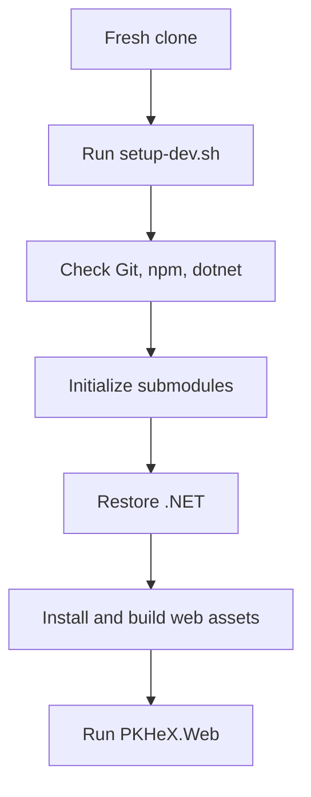
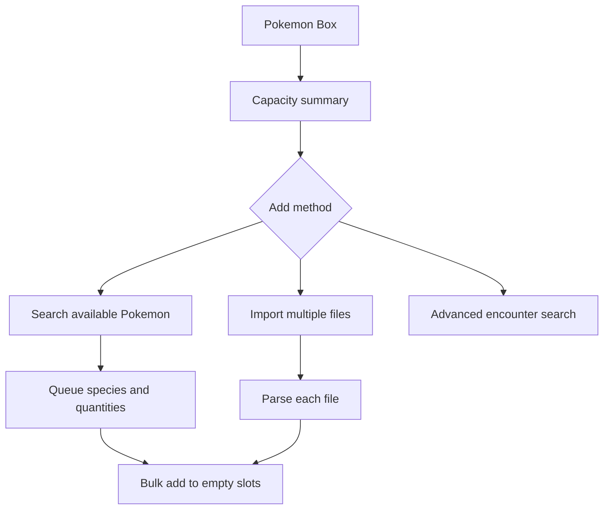
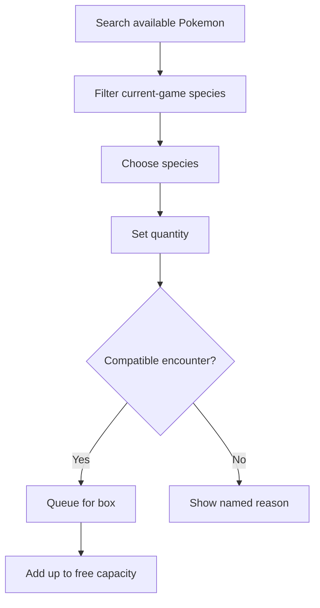
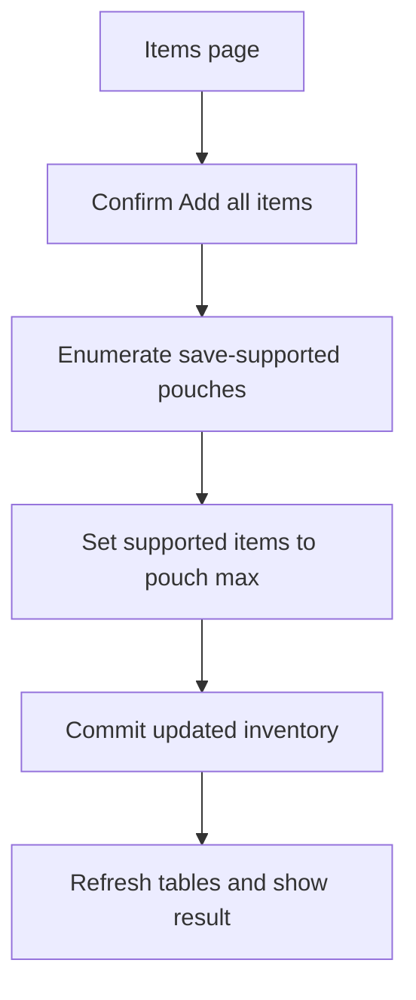

# PKHeX Everywhere Easier Setup and Bulk Management Plan

Date: 2026-07-16

## Goal

Make local development a one-command setup and make common save-editing operations fast in the web app:

- Add every item supported by the loaded save, including all supported TMs/HMs, at the pouch maximum.
- Search for specific Pokemon and add multiple Pokemon or multiple species directly to available box slots.
- Browse and search Pokemon species available to the currently loaded game/save before adding them.
- Import multiple `.pk*` Pokemon files into the box in one operation.
- Preserve the existing detailed encounter-selection and Pokemon-editing workflow.

## Current State

- A fresh checkout requires undocumented submodule initialization, .NET restore, and two separate npm installs/builds.
- `Inventory.Set` supports one item at a time and commits after every item.
- Encounter search supports one species and routes through one encounter/editor before adding one Pokemon.
- The box file picker accepts and stages one Pokemon file at a time.
- `PokemonBox.AddOnEmptySlot` has no bulk result or partial-capacity reporting.

## Scope

### 1. One-command developer setup

Add a root `setup-dev.sh` that:

1. Fails clearly when Git, npm, or the .NET SDK required by `global.json` is unavailable.
2. Initializes both Git submodules recursively.
3. Restores the .NET solution.
4. Installs and builds `_js` and `_blog` from their lockfiles.
5. Prints the exact command to launch the web app.

Update the root and web READMEs so a new contributor can run `./setup-dev.sh` followed by one launch command. Keep `install.sh` documented as the end-user CLI installer, not the development bootstrap.

### 2. Bulk inventory fill

Add an `Inventory.SetAllSupportedToMax()` facade operation that updates the current pouch in memory and commits once. Add an `Inventories.SetAllSupportedToMax()` operation that fills every save-supported pouch and commits through the existing inventory abstractions.

The Items page gets a clearly labeled `Add all items` action with confirmation text stating that existing quantities will be replaced with each pouch maximum. This includes TM/HM pockets when the loaded save supports them; unsupported item IDs are never injected.

### 3. Fast multi-species box addition

Redesign the Pokemon Box action area around an explicit `Available Pokemon` workflow rather than opening with an encounter table. The focused workflow keeps the existing box table, adds an occupied/available slot summary, and presents a searchable catalog limited to species supported by the loaded game/save.

A user can queue repeatable rows containing:

- A searchable species selector limited to the loaded game.
- A quantity.
- A remove-row action.

For each row, the app uses the first compatible encounter generated for the loaded save/version, creates the requested Pokemon, and fills empty slots. The existing encounter search remains available as an advanced path when the user wants a particular encounter or wants to edit details before adding.

Bulk results report requested, added, skipped, and remaining box capacity. If capacity runs out, already-added Pokemon remain and the UI reports the partial result. Species with no compatible encounter are skipped and named in the result.

### 4. Multi-file Pokemon import

Enable multiple selection on the box `.pk*` picker. Parse each selected file independently, add each valid Pokemon directly to the next empty slot, and report:

- Files selected.
- Pokemon added.
- Invalid or unsupported files skipped.
- Files not added because the box became full.

One invalid file must not prevent valid files from being imported.

### 5. Focused UI/UX improvements

Apply the confirmed product direction: familiar, efficient, and trustworthy, using the existing Ant Design component vocabulary and light/dark theme support.

- Promote `Available Pokemon` search and `Import Pokemon files` to visible, separately labeled actions instead of hiding unrelated actions in one dropdown.
- Show box occupancy and remaining capacity before the user starts a bulk action.
- Keep calculator and Showdown export as secondary contextual actions.
- Use an inline/progressive bulk builder on wide screens and a responsive Ant Design overlay only where constrained space requires it.
- Show species icons and names in search results, selected rows, and operation results.
- Label quantities, use numeric input behavior on mobile, and place validation beside the affected row.
- Announce complete, partial, and failed outcomes; never rely on toast color alone.
- Preserve visible focus, logical tab order, Escape behavior for overlays, and focus return to the triggering control.
- Avoid a broad visual rebrand. Retain the existing Ant Design theme and Pokemon GB identity while improving spacing, hierarchy, action labels, and responsive behavior.

The UI/UX Pro Max recommendation for a data-dense utility is adopted, but its proposed neon-purple dashboard palette and Fira typography are rejected because they conflict with the existing product identity and would introduce unnecessary regression risk.

### 6. PKHeX-informed safeguards

Bring forward the useful behavior from desktop PKHeX without copying its desktop-only interaction model:

- Inventory bulk fill must respect cramped pouch capacity and report items that could not fit.
- Multi-file import defaults to empty slots only and never clears or overwrites existing Pokemon.
- Incompatible Pokemon files and species without a compatible encounter are skipped with named reasons.
- Detailed encounter selection remains available as an advanced workflow.
- A future visual 30-slot box grid is documented as a separate phase, not mixed into this focused workflow change.

## Design

## Expected File Changes

- `setup-dev.sh`: new idempotent developer bootstrap.
- `README.md`: prerequisites, one-command setup, and launch instructions.
- `src/PKHeX.Web/README.md`: align web development instructions with the root bootstrap.
- `src/PKHeX.Facade/Inventory.cs`: batch-fill one pouch without per-item commits.
- `src/PKHeX.Facade/Inventories.cs`: coordinate all-pouch fill.
- `src/PKHeX.Facade/PokemonBox.cs`: capacity and bulk-add result operation.
- `src/PKHeX.Web/Pages/Items.razor`: confirmation and all-items action.
- `src/PKHeX.Web/Pages/PokemonBox.razor`: capacity summary, Available Pokemon entry point, action hierarchy, and multi-file import handling.
- `src/PKHeX.Web/Components/AvailablePokemon.razor`: searchable current-game catalog, multi-species/quantity queue, and result presentation.
- `src/PKHeX.Web/wwwroot/css/app.css`: minimal responsive and focus styling shared by the new workflow.
- `src/PKHeX.Web/Services/EncounterService.cs`: generate a default compatible Pokemon for a selected species without changing the detailed search flow.
- `src/PKHeX.Facade.Tests/InventoryTests.cs`: supported-item/max-count persistence coverage.
- `src/PKHeX.Facade.Tests/PokemonBoxTests.cs`: bulk capacity, partial-add, and persistence coverage.

The exact component boundary may be reduced during implementation if the existing page remains clear without a separate component.

## Acceptance Criteria

| Area          | Acceptance criterion                                                                                                                   |
| ------------- | -------------------------------------------------------------------------------------------------------------------------------------- |
| Setup         | A fresh clone can be prepared with `./setup-dev.sh`, including submodules and both frontend asset projects.                            |
| Setup         | Missing prerequisites produce actionable errors instead of failing later in the build.                                                 |
| Items         | One confirmed action fills every item supported by the loaded save to its pouch maximum.                                               |
| Items         | TM/HM items are included where supported, and unsupported items are never added.                                                       |
| Items         | Save/reload preserves the bulk-filled inventory.                                                                                       |
| Pokemon       | A user can search one species, enter a quantity, and add it without opening the detailed editor.                                       |
| Pokemon       | Search results include only species available to the currently loaded game/save and identify species without a compatible encounter.   |
| Pokemon       | A user can submit multiple species/quantity rows in one operation.                                                                     |
| Pokemon       | Bulk addition never overwrites occupied slots and clearly reports partial completion when capacity is insufficient.                    |
| Import        | A user can select multiple `.pk*` files and valid files are added even when another selected file is invalid.                          |
| Compatibility | Existing single encounter editing, single-file staging, calculator, and Showdown exports continue to work.                             |
| UI/UX         | The Box page shows capacity before adding, exposes primary actions clearly, and remains usable at 375px and 200% zoom.                 |
| Accessibility | New controls meet WCAG 2.2 AA keyboard, focus, labeling, contrast, and announced-result requirements.                                  |
| Quality       | Facade tests pass, the web project builds, browser console has no new errors, and desktop/mobile E2E recordings cover the new actions. |

## Verification

1. Run the formatter available for each changed file type.
2. Run focused facade tests for inventory and box behavior.
3. Run the complete facade test project.
4. Build the web project in Release configuration.
5. Start the web app and verify the Items and Pokemon Box workflows in Chrome DevTools with zero console errors.
6. Run keyboard, 200% zoom, responsive viewport, contrast, and automated accessibility checks on the changed surfaces.
7. Record and frame-check 1080p desktop and mobile MP4 walkthroughs covering all acceptance criteria.
8. Run simplify, code review, reuse audit, dead-code scan, and improvement gauge before completion.

## Non-goals

- Adding the same bulk commands to the CLI in this iteration.
- Generating unsupported event-only Pokemon without a compatible encounter.
- Replacing the detailed encounter editor.
- Replacing the existing box table with a desktop-style 30-slot visual box grid.
- Changing PKHeX.Core legality rules or save-format constraints.
- Automatically saving over the user's original save file.
